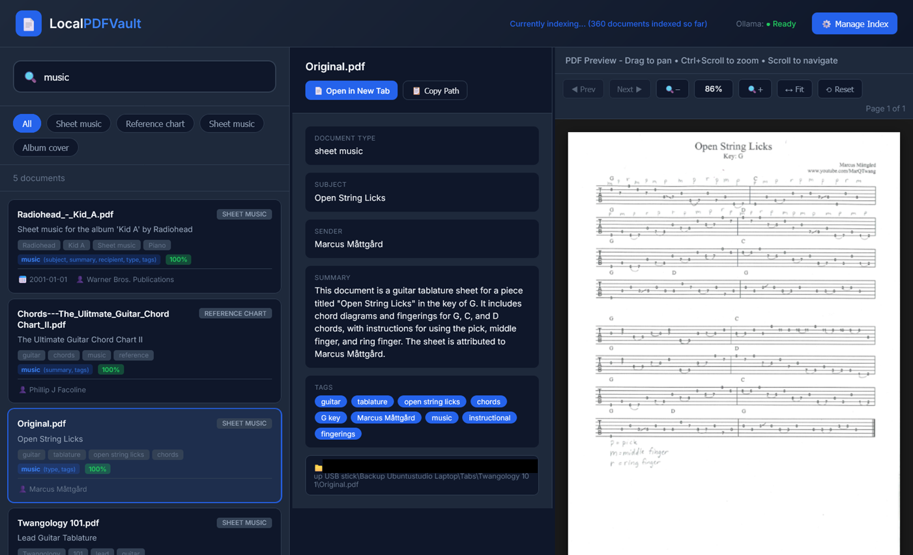

# LocalPDFVault 🔒📄

[](https://opensource.org/licenses/MIT)
[](https://www.docker.com/)
[](https://ollama.ai)

**Privacy-focused AI-powered local PDF search appliance.**

LocalPDFVault is a self-hosted "Vault" application that uses local AI vision models (via Ollama) to automatically index and search your PDF documents. It runs as a secure Docker container with read-only access to your archive, ensuring your documents are never modified or sent to the cloud.



---

## ✨ Features

### 🌐 Web Interface
- **Modern Search UI** - Clean, responsive design for all devices
- **Instant Search** - Real-time fuzzy search with intelligent relevance ranking
- **PDF Preview** - Built-in viewer with zoom, pan, and page navigation
- **Update Index** - One-button update to keep your index in sync with your files
- **Dark Mode** - Professional, eye-friendly interface

### 🤖 AI Intelligence
- **Vision Model Analysis** - "Reads" your PDFs using local Ollama models
- **Smart Metadata** - Extracts subject, summary, dates, sender/recipient, and type
- **Auto-Tagging** - Generates relevant categorization tags automatically
- **100% Private** - All processing happens locally on your hardware

### 🔒 Security & Safety
- **Docker Isolation** - Runs in a sealed environment
- **Read-Only Vault** - Mounts your archive as `ro`, making it physically impossible for the app to delete or modify your files
- **Zero Telemetry** - No tracking, no phone-home, no cloud dependencies

---

## 🚀 Quick Start (Docker)

### Prerequisites

1.  **Ollama** - [Install Ollama](https://ollama.ai) (must be running on your host machine)
2.  **Docker & Docker Compose** - [Install Docker](https://docs.docker.com/get-docker/)

### 1. Installation

```bash
# Clone the repository
git clone https://github.com/yonie/local-pdf-vault.git
cd local-pdf-vault

# Download the AI vision model
ollama pull qwen3-vl:30b-a3b-instruct-q4_K_M
```

### 2. Configure your Vault

Edit `docker-compose.yml` to point to your PDF collection:

```yaml
    volumes:
      - ./pdfscanner.db:/app/pdfscanner.db
      - /path/to/your/pdfs:/data/pdfs:ro  # Change left side to your host path
```

### 3. Launch

```bash
docker-compose up -d
```

Open your browser to **http://localhost:4337**

### 4. Indexing

1.  Click **"⚙️ Manage Index"**
2.  Click **"🔄 Update Index"**
3.  The AI will now begin analyzing your documents. Results will appear in the search view as they are processed.

---

## 📖 How It Works

1.  **📁 Vault**: Mounts your host directory to `/data/pdfs` inside the container.
2.  **🤖 Analyze**: Local Ollama vision model "sees" the document pages.
3.  **📝 Extract**: AI extracts rich metadata (subject, summary, dates, tags).
4.  **💾 Index**: Searchable metadata is stored in a local SQLite database.
5.  **🔍 Search**: You get instant, tiered search results across your entire collection.

---

## ⚙️ Configuration

### Supported Models

Popular choices for the `OLLAMA_MODEL` environment variable:

| Model | Size | Performance | Accuracy |
|-------|------|-------------|----------|
| `qwen3-vl:30b-a3b-instruct-q4_K_M` | ~17GB | Fast | Excellent ⭐ |
| `llama3.2-vision:11b` | ~7GB | Very Fast | Good |
| `llava:13b` | ~8GB | Fast | Good |

### Environment Variables

Configure these in `docker-compose.yml`:
- `OLLAMA_HOST`: Set to `host.docker.internal` to reach your host's Ollama.
- `OLLAMA_MODEL`: Which vision model to use.
- `SCAN_DIRECTORY`: Internal path to scan (default: `/data/pdfs`).
- `MAX_PAGES_PER_END`: How many pages to scan for large PDFs.

---

## 🔧 Troubleshooting

### Connection to Ollama Failed
Ensure your host's Ollama is listening on all interfaces. On Windows/Linux, set the environment variable `OLLAMA_HOST=0.0.0.0` for the Ollama service.

### Vault Path Not Found
Verify that your host path in `docker-compose.yml` is absolute and correctly formatted. The app expects your PDFs to be mapped specifically to `/data/pdfs` inside the container.

---

## 📄 License
MIT License - Free for personal and commercial use.

**⭐ If you find this useful, please star the repository!**
